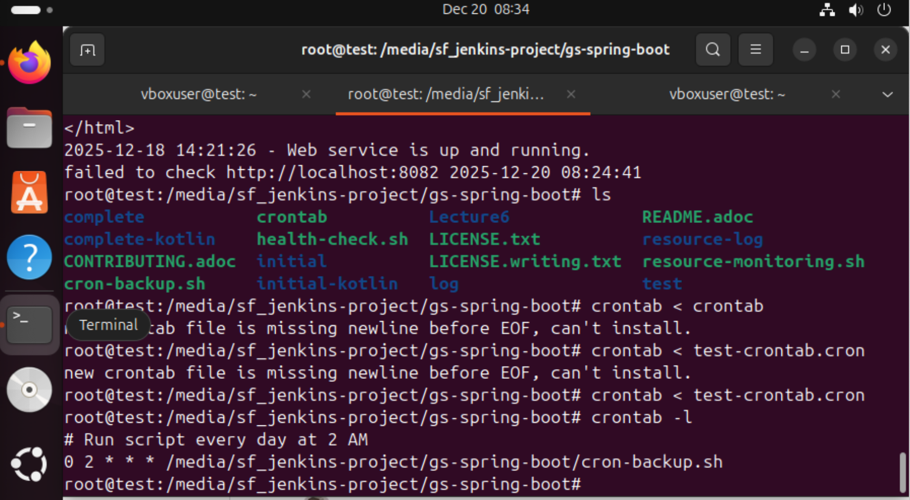
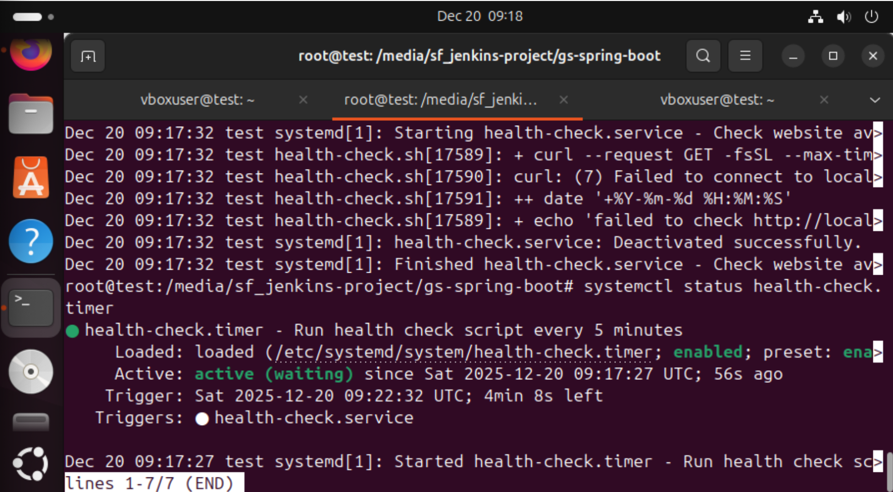
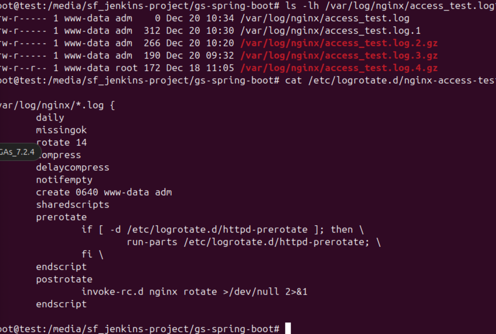
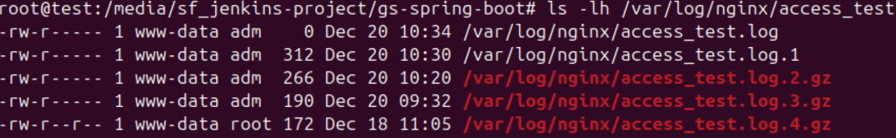

## Bash scripts and Automation
1. Create bash with
2. backup a directory every day at 2 am.
2. Create cron job for the bash script.
3. Create a bash script to monitor website health
4. Create cron job for the resource monitoring
5. Set up systemd timer to run a health-check script every 5 min.
6. Enable and start the timer.
7. Log file for health check results.
8. Create file rotation for acess_test.log. 
9. Test force rotate logrotate -f /etc/logrotate.d/nginx-access-test
10. View rotated log files. 
