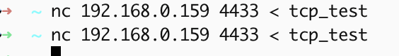
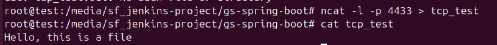
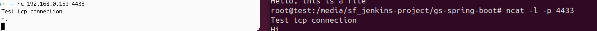
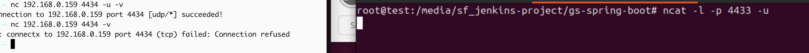
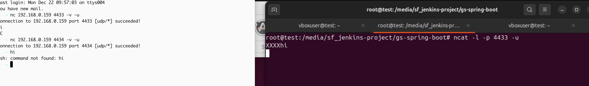
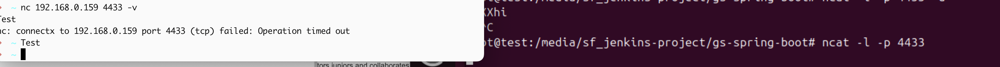
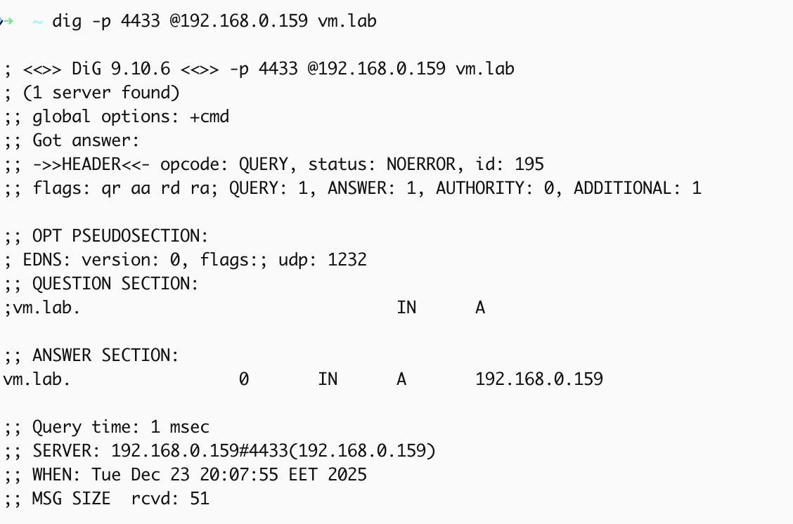
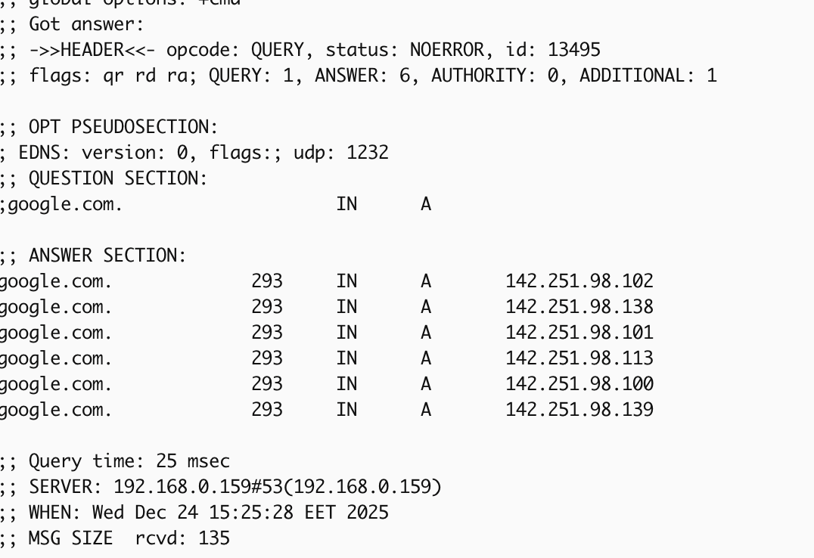

##  Network Technologies
1. Find host of VM with ifconfig
2. Set Vm as a server ncat -l -p 4433
3. Test connection from mac to VM with sending file ncat <VM IP> 4433 < tcp_test
4. Test TCP connection with ncat -l -p 4433 on VM and ncat <VM IP> 4433 on Mac 
5. Test UDP connection with ncat -u -l -p 4433 on VM and ncat -u <VM IP> 4433 on Mac 
6. Use -v flag to see more info about TCP connection to the listener  and random port
7. Use -v flag to see more info about UDP connection to the listener  and random port
8. We can see that TCP connection through ncat show an error when we try to connect to a closed port, while UDP connection does not show any error when connecting to a closed port. Message send from client but didn't show on server side
9. Enable firewall on VM, request from client machine failed with timeout 

##  DHCP server 
1. Set up DHCP server on VM using dnsmasq
2. Configure dnsmasq by adding  /etc/dnsmasq.d new config file to set test-dnsmasq1.conf the vm listen-address and ports
3. Validate dnsmasq config with sudo dnsmasq --test
4. Restart dnsmasq service with sudo systemctl restart dnsmasq
5. Check dnsmasq service status with sudo systemctl status dnsmasq --no-pager
6. Firewall inactive on VM
7. Check if DHCP server from my local machine with  dig -r 4433 @my.test.vm.ip vm.lab 
8. Dig google which is not in dnsmasq config 
9. We see Answers section 6 on google and 1 on vm.lab which means that when we guery vm.lab the request is handled by dnsmasq server (address row in dnsmasq config)
while google request forwards to upstream DNS (1.1.1.1/8.8.8.8), because it's not in dnsmasq config file. Then this aswer is cached by dnsmasq for future requests. And we can se that response time 25ms

## Split to subnets
1. We need to have 10 subnets which contains  from 5 to 11 hosts
2. To get 11 hosts we need to borrow 4 bits from host part (2^4=16 subnets)
3. We can use subnet mask /28  (32-28=4 bits for host part)
4. Subnet mask /28 in decimal is 16 addresses and we need 10 subnets -> 16*10=160 addresses
5. We have reserved 10.0.1.0/24 and 10.0.0.32/26 -> 10.0.1.x - fully reserved for /24 and 10.0.0.32 - 10.0.0.95 reserved for /26
6. So we can use list of subnets from:
   10.0.0.96/28 — subnet: 10.0.0.97–10.0.0.110 - host, broadcast: 10.0.0.111
   10.0.0.112/28 — subnet: 10.0.0.113–10.0.0.126 - host, broadcast: 10.0.0.127
   10.0.0.128/28 — subnet: 10.0.0.129–10.0.0.142 - host, broadcast: 10.0.0.143
   10.0.0.144/28 — subnet: 10.0.0.145–10.0.0.158 - host, broadcast: 10.0.0.159
   10.0.0.160/28 — subnet: 10.0.0.161–10.0.0.174 - host, broadcast: 10.0.0.175
   10.0.0.176/28 — subnet: 10.0.0.177–10.0.0.190 - host, broadcast: 10.0.0.191
   10.0.0.192/28 — subnet: 10.0.0.193–10.0.0.206 - host, broadcast: 10.0.0.207
   10.0.0.208/28 — subnet: 10.0.0.209–10.0.0.222 - host, broadcast: 10.0.0.223
   10.0.0.224/28 — subnet: 10.0.0.225–10.0.0.238 - host, broadcast: 10.0.0.239
   10.0.0.240/28 — subnet: 10.0.0.241–10.0.0.254 - host, broadcast: 10.0.0.255

